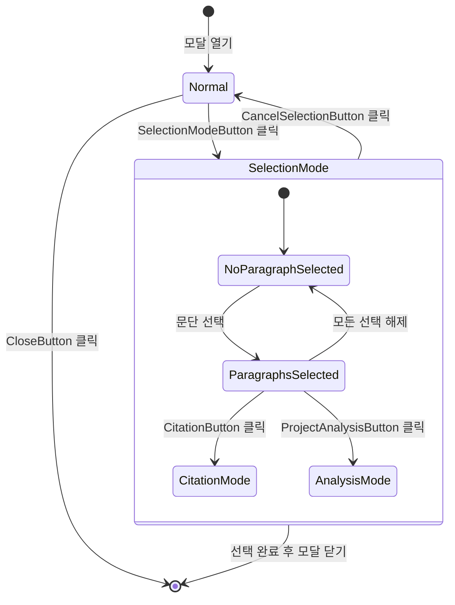

# 파일 미리보기 모달 UI 디자인

본 컴포넌트의 UI/UX는 [GlobalUIDesign.md](../../ui_structure/GlobalUIDesign.md)에서 정의된 공통 디자인 시스템을 따릅니다.

## 1. 개요
파일 미리보기 모달은 다음 유형의 파일들을 미리보기할 수 있는 모달 컴포넌트입니다:

- 증거자료 파일 (Evidence)
- 주장서류 파일 (ClaimingDocument)
- 참고자료 파일 (ConsiderableDocument)
- 프로젝트최종결정문 파일 (ProjectFinalJudgement)

## 2. UI 컴포넌트 구조
```
app/
├── components/
│   └── preview_modal/
│       ├── FilePreviewModalContainer.tsx  // 모달의 최상위 컨테이너, 크기: 화면의 70% (최소 너비 800px)
│       ├── header/
│       │   ├── PreviewHeader.tsx  // 재사용: LawPreviewModalUIDesign.md의 PreviewHeader.tsx, 높이: 60px
│       │   ├── FileTitle.tsx      // 파일 제목 표시 (왼쪽 정렬)
│       │   ├── FileType.tsx       // 파일 유형 뱃지 표시 (중앙)
│       │   ├── selection_mode/    // 문단 선택 모드 컨트롤
│       │   │   ├── SelectionModeButton.tsx    // "문단 선택" 버튼
│       │   │   └── CancelSelectionButton.tsx  // "선택 취소" 버튼
│       │   └── CloseButton.tsx    // 재사용: GlobalUIDesign.md의 CloseButton.tsx, 모달 닫기
│       ├── content/
│       │   ├── PreviewContent.tsx  // 재사용: LawPreviewModalUIDesign.md의 PreviewContent.tsx, 높이: calc(100% - 120px)
│       │   ├── FileContent.tsx     // 파일 내용 표시 영역
│       │   ├── selection/          // 문단 선택 관련 컴포넌트
│       │   │   ├── ParagraphSelectionOverlay.tsx  // 문단 선택 시 오버레이
│       │   │   ├── HoverBox.tsx                   // 문단 호버 시 표시되는 박스
│       │   │   └── SelectionCheckbox.tsx          // 문단 선택용 체크박스 (우상단)
│       │   ├── navigation/         // 페이지 네비게이션
│       │   │   ├── PageNavigation.tsx  // 재사용: LawPreviewModalUIDesign.md의 PageNavigation.tsx
│       │   │   └── ZoomControls.tsx    // 확대/축소 컨트롤 (100%, 125%, 150%, 175%, 200%)
│       └── footer/
│           ├── PreviewFooter.tsx  // 재사용: LawPreviewModalUIDesign.md의 PreviewFooter.tsx, 높이: 60px
│           ├── selected_items/    // 선택된 항목 표시
│           │   ├── SelectedItemsChips.tsx  // 선택된 문단 목록 (최대 높이: 80px)
│           │   └── ItemChip.tsx            // 개별 선택 항목 칩 (자료명, 페이지, 문단번호 포함)
│           ├── CitationButton.tsx  // 재사용: GlobalUIDesign.md의 CitationButton.tsx, 인용 추가
│           ├── ProjectAnalysisButton.tsx  // 프로젝트 분석 반영 버튼
│           └── FileMetadata.tsx    // 재사용: LawPreviewModalUIDesign.md의 LawMetadata.tsx, 파일 메타데이터
```

## 3. 상세 컴포넌트 설명

### 3.1 FilePreviewModalContainer
- 모달의 최상위 컨테이너
- 크기: 화면의 70% (최소 너비 800px)

### 3.2 PreviewHeader
- 높이: 60px
- 구성요소:
  - FileTitle: 파일 제목 (왼쪽 정렬)
  - FileType: 파일 유형 뱃지 (중앙)
  - CloseButton: 모달 닫기 버튼 (오른쪽 정렬)

### 3.3 PreviewContent
- 높이: calc(100% - 120px)
- 스크롤: vertical
- 구성요소:
  - FileContent: 파일 내용 표시
  - PageNavigation: 페이지 이동 컨트롤 (다중 페이지 파일의 경우)
  - ZoomControls: 확대/축소 컨트롤

### 3.4 PreviewFooter
- 높이: 60px
- 구성요소:
  - CitationButton: 인용 추가 버튼
  - FileMetadata: 파일 메타데이터 표시 (작성일, 작성자 등)

### 3.5 SelectionModeControls
- 위치: PreviewHeader 우측 (CloseButton 왼쪽)
- 구성요소:
  - SelectionModeButton:
    - 텍스트: "문단 선택"
  - CancelSelectionButton:
    - 텍스트: "선택 취소"
    - 선택 모드 비활성화 시 숨김

### 3.6 ParagraphSelectionOverlay
- 문단 호버 시 표시되는 UI 요소:
  - HoverBox
  - SelectionCheckbox:
    - 위치: 문단 우상단
    - 크기: 20x20px

### 3.7 SelectedItemsChips
- 위치: PreviewFooter 상단
- 최대 높이: 80px (2줄)
- 스크롤: horizontal
- 구성요소:
  - ItemChip:
    - 구성:
      - 자료명: 볼드체
      - 구분자: " | "
      - 페이지: "p.숫자"
      - 문단번호: "#숫자"
      - 삭제 버튼: X 아이콘

### 3.8 ProjectAnalysisButton
- 위치: PreviewFooter의 CitationButton 오른쪽
- 아이콘: 프로젝트 분석 아이콘
- 텍스트: "프로젝트 분석에 반영"
- 드롭다운 메뉴:
  - 너비: 200px
  - 구분선으로 우리측/상대측 구분
  - 각 항목 호버 시 배경색: #F3F4F6
  - 선택된 항목 배경색: #F0F9FF
  - 아이콘 포함:
    - 목표: 🎯
    - 주장: 💭
    - 증거: 📄

## 4. 인터랙션

### 4.1 모달 표시/숨김
- 표시 트리거: 파일 항목 hover 시 (지연시간 200ms)
- 숨김 트리거:
  - CloseButton 클릭
  - 모달 외부 영역 클릭
  - ESC 키 입력

### 4.2 파일 조작
- 확대/축소: 
  - 버튼 클릭 (100%, 125%, 150%, 175%, 200%)
  - Ctrl + 마우스 휠
- 페이지 이동:
  - 이전/다음 페이지 버튼
  - 페이지 번호 직접 입력
  - 키보드 방향키

### 4.3 인용
- CitationButton 클릭 시 현재 파일의 인용 정보를 클립보드에 복사

### 4.4 문단 선택 모드
- 활성화 트리거: SelectionModeButton 클릭
- 비활성화 트리거: 
  - CancelSelectionButton 클릭
  - 선택 완료 후
  - ESC 키 입력

#### 문단 선택 인터페이스
- 문단 호버 시:
  - 해당 문단에 네모박스 표시
  - 우상단에 체크박스 표시
- 문단 선택:
  - 체크박스 클릭으로 다중 선택 가능
  - 선택된 문단은 하이라이트 처리
  - 선택된 문단은 하단 SelectedItemsChips에 추가
    - 칩 형태로 자료명/페이지/문단번호 표시
    - 칩 클릭 시 해당 문단으로 스크롤
    - 칩 삭제 버튼으로 개별 선택 해제 가능

#### 선택 완료 액션
1. 문서 에디터 인용
   - CitationButton 클릭 시:
     - 선택된 문단들을 현재 작성 중인 문서에 인용 형식으로 삽입
     - 인용 시 자동으로 각주/미주 생성
     - 모달 자동 종료

2. 프로젝트 분석 반영
   - ProjectAnalysisButton 클릭 시 드롭다운 메뉴 표시:
     - 우리측 목표에 반영
     - 우리측 주장에 반영
     - 우리측 증거자료로 반영
     - 상대측 목표에 반영
     - 상대측 주장에 반영
     - 상대측 증거자료로 반영
   - 선택 시:
     - 해당 항목에 선택된 문단들 자동 반영
     - 모달 자동 종료

### 4.5 키보드 단축키
- `Ctrl + E`: 선택 모드 토글
- `Ctrl + Enter`: 선택 완료
- `Shift + 클릭`: 연속된 문단 다중 선택
- `Ctrl + 클릭`: 개별 문단 다중 선택
- `Ctrl + A`: 현재 페이지의 모든 문단 선택
- `Delete` 또는 `Backspace`: 선택된 문단 선택 해제

### 4.6 드래그 앤 드롭
- 선택된 문단을 다음 대상으로 드래그 가능:
  - 문서 에디터
  - 댓글 작성 영역
  - 채팅 입력창
- 드래그 시 시각적 피드백:
  - 드래그 가능 영역 하이라이트
  - 드래그 중인 콘텐츠 미리보기
  - 드롭 가능 여부 표시

## 5. 반응형 디자인
- 모바일 화면 (<768px):
  - 전체 화면 모달로 전환
  - 줌 컨트롤을 하단 툴바로 이동
  - 터치 제스처 지원 (핀치 줌, 스와이프 페이지 전환)

## 6. 접근성
- ARIA 레이블 및 역할 적용
- 키보드 네비게이션 지원
- 고대비 모드 지원
- 스크린 리더 호환성 보장

## 7. 성능 최적화
- 파일 렌더링 지연 로딩
- 이미지 최적화
- 페이지 캐싱
- 가상 스크롤 적용 (큰 파일의 경우) 

## 8. 상태 관리

### 8.1 선택 모드 상태
```typescript
interface SelectionModeState {
  isActive: boolean;
  selectedParagraphs: {
    id: string;
    pageNumber: number;
    paragraphNumber?: number;
    content: string;
  }[];
}
```

### 8.2 선택 데이터 구조
```typescript
interface SelectedItem {
  documentId: string;
  documentTitle: string;
  pageNumber: number;
  paragraphNumber?: number;
  content: string;
  timestamp: number;
}
```

### 8.3 상태 변경 이벤트
- `onSelectionModeToggle`: 선택 모드 전환
- `onParagraphSelect`: 문단 선택/해제
- `onSelectionComplete`: 선택 완료 처리
- `onSelectionCancel`: 선택 모드 취소 

## 9. 위젯 트리 상세
```
FilePreviewModal/
├── FilePreviewModalContainer/
│   ├── ModalOverlay (배경 딤처리)
│   └── ModalContent/
│       ├── PreviewHeader/
│       │   ├── HeaderLeft/
│       │   │   ├── FileIcon (파일 타입별 아이콘)
│       │   │   └── FileTitle (파일 제목)
│       │   ├── HeaderCenter/
│       │   │   └── FileTypeBadge (파일 유형 뱃지)
│       │   └── HeaderRight/
│       │       ├── SelectionModeControls/
│       │       │   ├── SelectionModeButton/
│       │       │   │   ├── CheckboxIcon
│       │       │   │   └── ButtonText
│       │       │   └── CancelSelectionButton/
│       │       │   │       ├── XIcon
│       │       │   │   └── ButtonText
│       │       │   └── CloseButton
│       ├── PreviewContent/
│       │   ├── ContentWrapper/
│       │   │   ├── FileContent/
│       │   │   │   └── ParagraphList/
│       │   │   │       └── Paragraph[]/
│       │   │   │           ├── ParagraphSelectionOverlay/
│       │   │   │           │   ├── HoverBox
│       │   │   │           │   └── SelectionCheckbox
│       │   │   │           └── ParagraphContent
│       │   │   └── SelectionHighlight[] (선택된 문단 하이라이트)
│       │   ├── PageNavigation/
│       │   │   ├── PrevButton
│       │   │   ├── PageInput
│       │   │   ├── TotalPages
│       │   │   └── NextButton
│       │   └── ZoomControls/
│       │       ├── ZoomOutButton
│       │       ├── ZoomPercentage
│       │       └── ZoomInButton
│       └── PreviewFooter/
│           ├── SelectedItemsChips/
│           │   └── ItemChip[]/
│           │       ├── ChipContent/
│           │       │   ├── DocumentTitle
│           │       │   ├── Separator
│           │       │   ├── PageNumber
│           │       │   └── ParagraphNumber
│           │       └── DeleteButton
│           ├── FooterLeft/
│           │   └── FileMetadata/
│           │       ├── LastModified
│           │       └── Author
│           └── FooterRight/
│               ├── CitationButton/
│               │   ├── CitationIcon
│               │   └── ButtonText
│               └── ProjectAnalysisButton/
│                   ├── AnalysisIcon
│                   ├── ButtonText
│                   └── DropdownMenu/
│                       ├── OurSideSection/
│                       │   ├── GoalItem
│                       │   ├── ClaimItem
│                       │   └── EvidenceItem
│                       └── OpponentSection/
│                           ├── GoalItem
│                           ├── ClaimItem
│                           └── EvidenceItem
```

## 10. 상태 전이도
